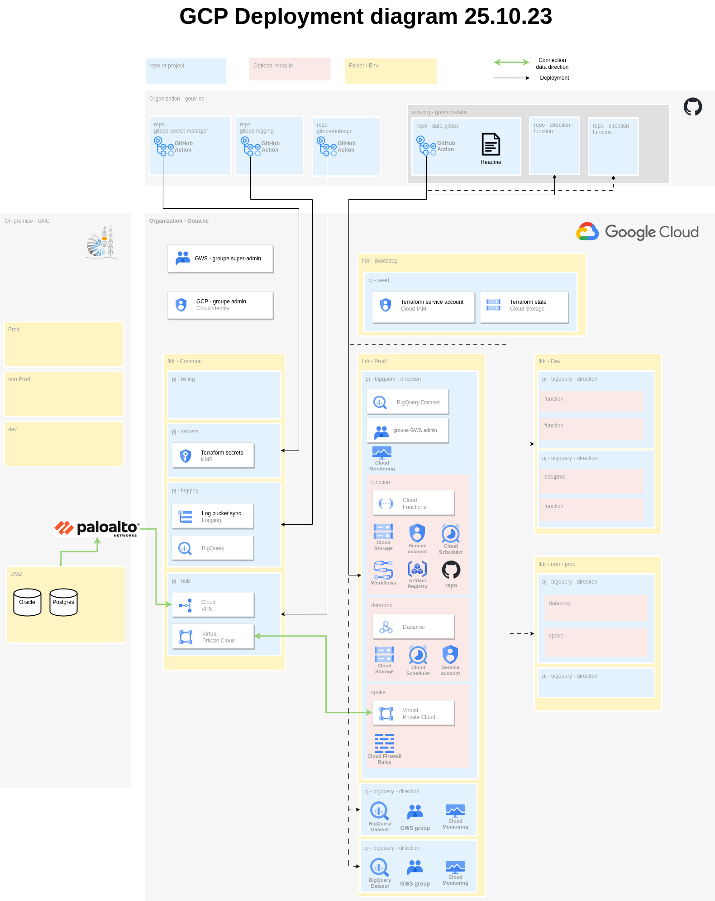
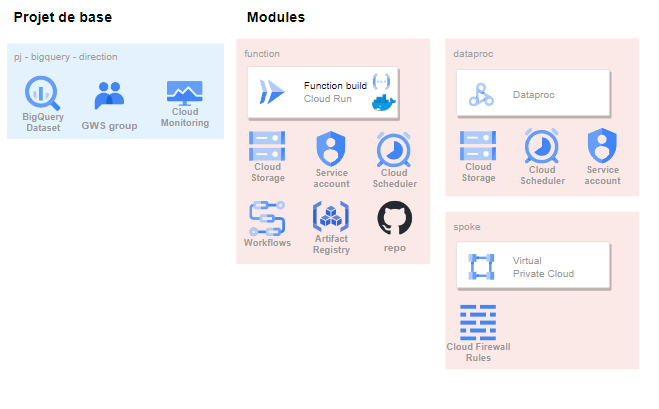

Google Cloud Platform (GCP) est le cloud provider choisi par le GNC.  
Cette plateform permet d'utiliser une infrastructure informatique dématerialisée.

Ainsi nous avons accès à toute la suite applicative déployée et maintenue par Google sur chacun des projets qui en font partie.
Cette infrastructure est actuellement gérée par l'équipe Data de la Dinum via Terraform, un outil qui permet de faire de l'infrastructure as code (IaC).

Lors de la création d'un nouveau projet sur GCP des modules préconstruis permettent de déployer automatiquement des applications, des groupes google workspace ou encore des rôles et permissions associées.

# Schéma global

# Projet modules

