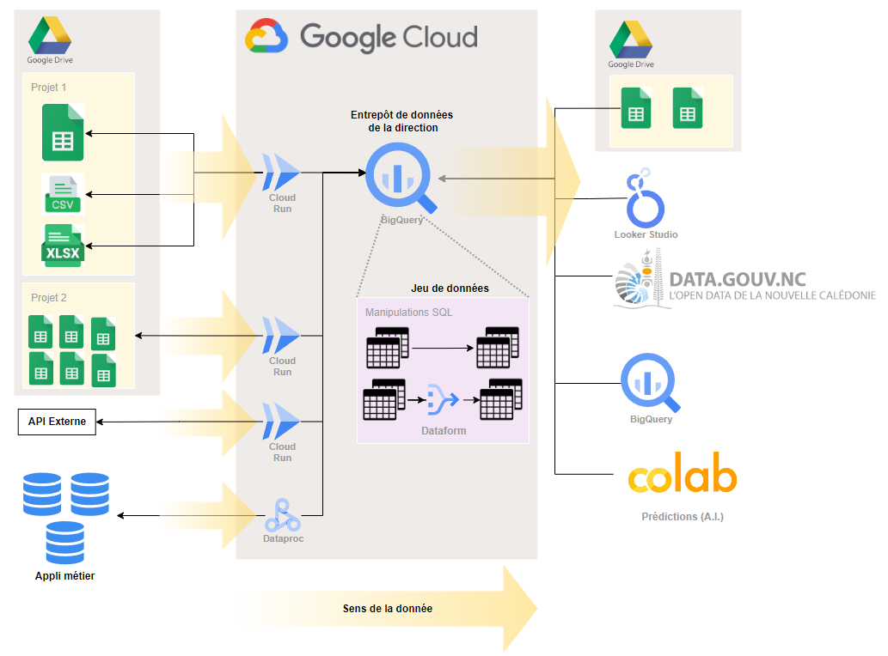

## Quel type de documentation vous trouverez ici

documentation liée aux outils et processus data  

## Exemple
Schéma d'architecture d'un processus Extract Transform and Load (ETL)

## Sommaire

* [Big Query](/docs/BigQuery/): Documentation liée à BigQuery
* [Examples](/docs/GCP/): Tout ce qui concerne GCP

